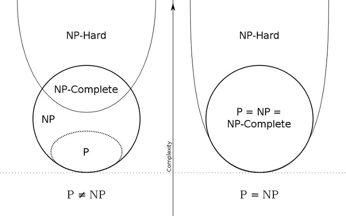

> <b>Promblem</b> is in class `P or NP` (not solution)

p

polynomial - n^k
exponential - K^n

# Polynomial Time : Class P
- if solution <b> exists</b> : solved in polynomial time 

# Non-Deterministic Polynomial Time : Class NP
- input and output is not always the same 
- if solution <b> exists</b> : sovled in polynomial time 

Therefore NP includes P 

## NP-Hard
- Every NP can be can be reduced to certain problem in polynomial time, 
  - NP-Hard is "harder" then all NP class
- NP-hard is not all NP class

## NP-Complete
- NP-Hard and included in NP

## co-NP

### extra
- traveling sales person problem is not NP-complete but not P.
